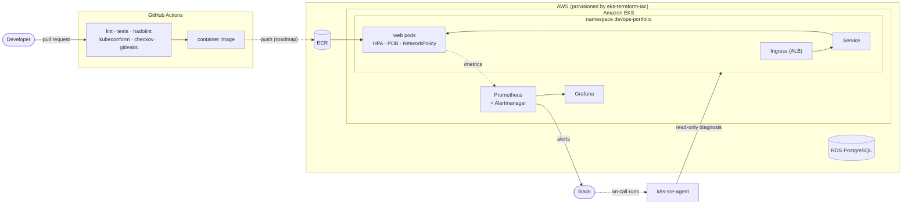

# DevOps & Platform Engineering Portfolio

**Omar Yousfi, DevOps / Platform Engineer. I build cloud platforms on Kubernetes, Terraform and AWS, deliver them through CI/CD, and apply AI agents to operations work.**

[](https://github.com/Sudo-oy/devops-portfolio/actions/workflows/ci.yml)
[](LICENSE)


This repository is the entry point to my open source work. It has two parts: an index of the projects I maintain, and a **reference delivery platform** (a containerized service with Kubernetes manifests, monitoring and a CI pipeline with security gates) that shows how these projects fit together.

## Featured projects

| Project | What it does | Highlights |
|---|---|---|
| [**eks-terraform-iac**](https://github.com/Sudo-oy/eks-terraform-iac) | Terraform module that ships an Amazon EKS cluster, its VPC, ECR repositories and an optional private PostgreSQL database in one `module` block | Typed and validated inputs, Secrets Manager-managed DB password, `terraform test` with a mocked provider, tflint + checkov + terraform-docs in CI |
| [**k8s-sre-agent**](https://github.com/Sudo-oy/k8s-sre-agent) | Read-only CLI that diagnoses a broken Kubernetes namespace and writes a root cause analysis | 8 deterministic detectors with symptom/cause correlation, pluggable LLM providers (Anthropic, OpenAI-compatible, Ollama), secret redaction, reproducible kind demo tested in CI |
| **devops-portfolio** (this repo) | Reference delivery platform | Hardened container, Kustomize manifests (restricted Pod Security, NetworkPolicy, HPA, PDB), RED metrics, alerting rules and Grafana dashboard |

## How the pieces fit together



More detail in [docs/architecture.md](docs/architecture.md).

## Reference platform: quick start

Build and run the reference service locally:

```bash
git clone https://github.com/Sudo-oy/devops-portfolio.git && cd devops-portfolio
docker build -t devops-portfolio:dev app
docker run --rm -p 8080:8080 --read-only --tmpfs /tmp devops-portfolio:dev
```

Then open <http://localhost:8080>, <http://localhost:8080/healthz> and <http://localhost:8080/metrics>.

To deploy it on a cluster (kind, minikube or EKS), make the image available to the cluster (for example `kind load docker-image devops-portfolio:dev`), point the manifests at it and apply them:

```bash
(cd k8s/base && kustomize edit set image ghcr.io/sudo-oy/devops-portfolio=devops-portfolio:dev)
kubectl apply -k k8s/base
```

## Repository layout

```text
app/          Flask service: /, /healthz, /readyz, /metrics (Prometheus), tests, hardened Dockerfile
k8s/base/     Kustomize base: Deployment, Service, Ingress, HPA, PDB, NetworkPolicy, restricted Pod Security
monitoring/   Prometheus Helm values with alerting rules, Alertmanager config, Grafana dashboard
docs/         Architecture, tech stack and troubleshooting notes
.github/      CI pipeline, issue and pull request templates
```

## Configuration

The service reads its configuration from environment variables (see [`.env.example`](.env.example)). In Kubernetes they come from the `web-config` ConfigMap.

| Variable | Description | Default |
|---|---|---|
| `APP_ENV` | Environment name returned by `/` | `development` |
| `APP_VERSION` | Version returned by `/` | `dev` |
| `PORT` | Port used by `python app.py` (the container always listens on 8080) | `8080` |

The Alertmanager Slack webhook is mounted from a Kubernetes Secret and is never stored in the repository.

## Tech stack

| Area | Tools |
|---|---|
| Cloud & IaC | AWS (EKS, VPC, ECR, RDS, IAM, CloudWatch), Terraform, tflint, checkov, terraform-docs |
| Containers & orchestration | Docker, Kubernetes, Kustomize, Helm, Pod Security Standards, NetworkPolicy |
| CI/CD | GitHub Actions, GitLab CI, Argo CD (GitOps) |
| Observability | Prometheus, Alertmanager, Grafana |
| Languages | Python, HCL, Bash |
| AI for operations | LLM-assisted incident analysis (Anthropic, OpenAI-compatible, Ollama) |

See [docs/tech-stack.md](docs/tech-stack.md) for the rationale behind each choice.

## Roadmap

- [ ] Argo CD `Application` and environment overlays (`k8s/overlays/staging`, `k8s/overlays/production`)
- [ ] Publish the image to GHCR with provenance attestations and digest pinning
- [ ] End-to-end job deploying the manifests to kind in CI
- [ ] GitLab CI equivalent of the pipeline (`.gitlab-ci.yml`)
- [ ] OpenTelemetry tracing for the reference service
- [ ] Wire `k8s-sre-agent` into Alertmanager as an automated first responder

## Contributing

Issues and pull requests are welcome. See [CONTRIBUTING.md](CONTRIBUTING.md), the [Code of Conduct](CODE_OF_CONDUCT.md) and the [security policy](SECURITY.md).

## License

[Apache License 2.0](LICENSE)
