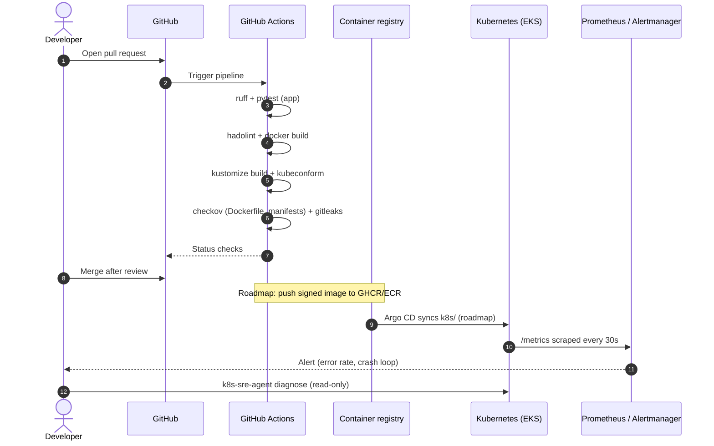

# Architecture

## Delivery flow



## Runtime view

| Component | Choice | Why |
|---|---|---|
| Workload | `Deployment` with 2 replicas, `maxUnavailable: 0` | Zero-downtime rolling updates |
| Scaling | `HorizontalPodAutoscaler` on CPU (70 %, 2-5 replicas) | Absorb load peaks without manual action |
| Disruptions | `PodDisruptionBudget` `minAvailable: 1` | Node drains never remove every replica |
| Spreading | `topologySpreadConstraints` on hostname | Survive the loss of one node |
| Security | Restricted Pod Security, non-root UID 10001, read-only root filesystem, all capabilities dropped, no service account token | Minimal attack surface |
| Network | Default-deny `NetworkPolicy`, ingress on 8080, DNS egress only | Contain lateral movement |
| Health | `/readyz` for readiness, `/healthz` for liveness | Traffic only reaches ready pods |
| Observability | RED metrics (`http_requests_total`, `http_request_duration_seconds`) | Error rate and latency SLOs |

## Infrastructure

The AWS foundation (VPC, EKS, ECR, optional RDS) is provisioned with the reusable
[terraform-aws-eks-platform](https://github.com/Sudo-oy/terraform-aws-eks-platform) module:

```hcl
module "platform" {
  source = "github.com/Sudo-oy/terraform-aws-eks-platform?ref=v0.1.0"

  name             = "portfolio"
  ecr_repositories = ["devops-portfolio"]
}
```
